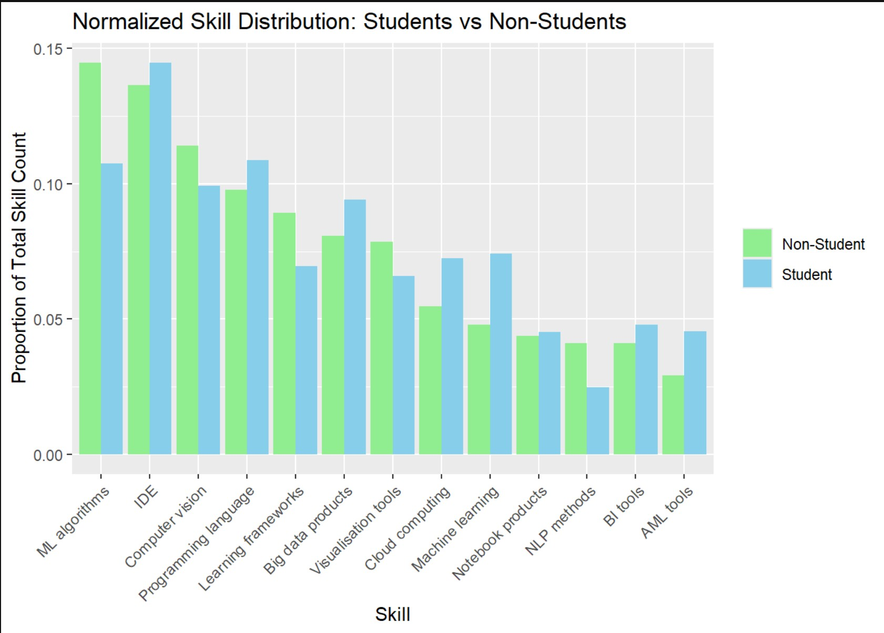

```{r setup, include=FALSE}
knitr::opts_chunk$set(echo = TRUE)
library(tidyr)
library(dplyr)
library(ggplot2)
library(readr)
library(stringr)
```


```{r}
kaggle_data <- read_csv("C:/Jerald/Colelge/Semester 1/DATA607_Project3/Final_counts_KaggleSurvey.csv", )  
job_data <- read_csv("C:/Jerald/Colelge/Semester 1/DATA607_Project3/Final_counts_Asaniczka2024.csv", n_max = 300)


head(kaggle_data)
head(job_data)


```


Giving categories to the job skills dataset 


```{r include=FALSE}
# Define skill categories as a named list
skill_categories <- list(
  "Programming Languages" = c("Python", "SQL", "R", "pyspark", "Java", "nosql", "Scala" , "numpy", "mysql", "pandas", "JavaScript", "kafka", "C\\+\\+", "C#", "MATLAB", "Go", "Bash", "PL/SQL", "TSQL"),
  "Notebook Products" = c("Databricks", "Sagemaker", "Jupyter"),
  "Visualization Tools" = c("Tableau", "Power BI", "Matplotlib", "Seaborn", "Looker", "Dashboards", "Data Storytelling", "Visualization"),
  "Learning Frameworks" = c("TensorFlow", "PyTorch", "Scikit-learn", "Keras", "XGBoost", "MLflow", "Spacy", "NLTK"),
  "ML Algorithms" = c("Machine Learning", "Deep Learning", "Supervised Learning", "Unsupervised Learning", "Reinforcement Learning", "Neural Networks", "Generative AI", "Large Language Models", "Machine Learning Algorithms", "Classification", "Clustering", "Regression", "Decision Trees", "Anomaly Detection", "Recommender Systems", "Time Series Analysis", "Causal Inference", "Predictive Modeling", "Applied Machine Learning", "Feature Engineering", "Optimization"),
  "Computer Vision" = c("Computer Vision", "Image Processing", "Object Detection", "Image Segmentation", "GANs", "Image Classification", "Image Recognition", "Speech Recognition", "Text Summarization", "Augmented Reality", "Virtual Reality", "3D Printing", "Drones"),
  "NLP Methods" = c("Natural Language Processing", "Sentiment Analysis", "Named Entity Recognition", "Text Summarization", "Spacy", "NLTK", "Transformers", "Speech Recognition"),
  "Cloud Computing" = c("AWS", "GCP", "Azure", "Cloud Computing", "Cloud Technologies", "Cloud Platforms", "Kubernetes", "Docker", "Terraform", "Helm", "CI/CD", "Cloud Services", "Serverless Computing", "Active Directory"),
  "Machine Learning" = c("ML", "Applied Machine Learning", "MLOps", "MLflow", "Model Deployment", "Experiment Design", "Data Science"),
  "Big Data Products" = c("Hadoop", "Spark", "Snowflake", "Redshift", "BigQuery", "Presto", "Athena", "Databricks", "Apache Spark", "Spark Streaming", "Storm", "EMR", "HBase", "Pig", "MapReduce", "Big Data Technologies"),
  "BI Tools" = c("Tableau", "Power BI", "powerbi", "Looker", "Qlik", "oracle", "Google Analytics", "Agile", "Sas", "SAP", "Data mining", "Data warehousing", "ETL", "Project Management", "SSRS", "Statistics", "Informatica", "Salesforce"),
  "AML Tools" = c("Risk Management", "Compliance", "Data Privacy", "Data Security")
)
```


```{r}
get_category <- function(skill) {
  skill_lower <- tolower(skill)
  category <- names(skill_categories)[sapply(skill_categories, function(skills) any(grepl(paste(tolower(skills), collapse = "|"), skill_lower)))]
  if (length(category) > 0) return(category[1]) else return("Other")
}


job_data <- job_data %>%
  mutate(skill_category = sapply(job_skills, get_category))

category_counts <- job_data %>%
  group_by(skill_category) %>%
  summarise(total_count = sum(count, na.rm = TRUE)) %>%
  filter(skill_category != "Other") %>%  
  arrange(desc(total_count))


head(category_counts)

```


```{r}
category_counts <- category_counts %>%
  mutate(proportion = total_count / sum(total_count))

ggplot(category_counts, aes(x = reorder(skill_category, proportion), y = proportion)) +
  geom_bar(stat = "identity") +
  labs(
    title = "Proportion of Each Skill Category",
    x = "Skill Category",
    y = "Proportion"
  ) +
  theme(axis.text.x = element_text(angle = 45, hjust = 1)) 
```


Well this just goes on to show that job listings enundate their requirement lists with mentions of programming languages. It takes up so much of the skills section that it accounts for almost 80 percent of the skills being required. As we had seen the graphs earlier, we know that Python , R , SQL and JAVA dominated the uncategorized skills section. So this is no suprise. To get a better spread we could use a logarithmic scale to better represent this proportion. 

```{r}
ggplot(category_counts, aes(x = reorder(skill_category, -total_count), y = total_count)) +
  geom_bar(stat = "identity") +
  scale_y_continuous(trans = 'log10') +  
  labs(
    title = "Logarithmic Scale Proportion of Each Skill Category",
    x = "Skill Category",
    y = "Logarithmic Scale of Total Count"
  ) +
  theme(axis.text.x = element_text(angle = 45, hjust = 1))
```
 
 This we believe is more representative of the actual spread of skills in demand for the job market in 2024. With Programming languages still in high demand, but we see Business Intelligence tools come in a close second. Visualisation tools follow suit . 2024 seems to also be the year of Cloud computing and Big data products. We can compare this with the graphs earlier from the Kaggle data to see how this data compares to the students and the employee graphs. 
 
 


The interest in Programming languages is seen across the board with workers students and the job market. In addition to that here we also see that Students focus more on learning Machine learning algorithms and different IDEs and learning frameworks, while the job market is more reliant on people with experitis in Business Intelligence tools. Clout computing is another field that is in the middle of the pack when it comes to students but in high demand in the job marketplace. 
 


